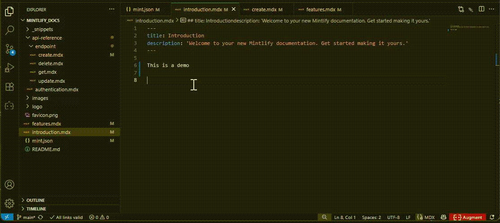

# FlashMintlify

> **Life is hard, writing should be easy!**

A super powerful extension that’ll make your Mintlify writing fly. It comes with intelligent component completion, automatic file reference tracking, smart link validation, and enhanced MDX editing experience.

🌟 Like this tool? Your star is my biggest motivation to keep improving!  
👉 [Click here to give FlashMintlify a star!](https://github.com/Match-Yang/FlashMintlify)  
Let more people discover and use the more efficient Mintlify writing experience!

## ✨ Key Features

### 🚀 Intelligent Component Completion
You don't need to remember all the rules!

You only need to type "<" to trigger the component completion.



You only need to type "```" to trigger the code block completion.


### 🔗 Smart Link Management & Validation
Real-time link validation and automatic updates:

- **Internal Link Validation**: Validates Mintlify internal links (`/path/to/page`)
- **Absolute Link Validation**: Checks file existence for absolute paths (`/images/logo.png`)
- **CodeLens Integration**: Shows "Open file" buttons for valid internal links
- **Status Bar Indicators**: Real-time count of invalid links in current file
- **Auto-Resolution**: Automatically tries `.mdx`, `.md`, `index.mdx`, `index.md` extensions


### 📁 Advanced File Reference Tracking
Intelligent language service that automatically maintains file references:

- **Auto-Update Imports**: Updates MDX imports when files are moved or renamed
- **Auto-Update Links**: Updates internal links when files are moved or renamed
- **Bulk Operations**: Handles folder renames with automatic reference updates
- **Navigation Sync**: Updates `mint.json` navigation when files are moved
- **Real-time Analysis**: Tracks file dependencies across your documentation


### 🎯 Efficient Context Menu Actions


### 🪄 Efficient CodeLens Actions

- **Open File**: Open the file that the internal link points to.


- **Generate and copy heading anchor**:  Using fixed anchor can avoid the failure to jump through the anchor after modifying the heading.


## ⚙️ Configuration

```json
{
  "flashMintlify.enableLanguageService": true
}
```

### Settings
- `flashMintlify.enableLanguageService`: Enable/disable automatic file reference tracking and updates

## 🛠️ System Requirements

- **VS Code**: 1.73.0 or higher
- **Project Structure**: Mintlify project with `mint.json` configuration
- **File Types**: `.md`, `.mdx`, `.json`, `.yaml`, `.yml` files

## 🤝 Contributing

We welcome contributions! This extension is open source and available on GitHub.

- 🐛 **Report Issues**: Found a bug? Let us know!
- 💡 **Feature Requests**: Have an idea? We'd love to hear it!
- 🔧 **Pull Requests**: Want to contribute code? Awesome!

## 📄 License

MIT License - see LICENSE file for details.

---

**Made with ❤️ for the Mintlify community**